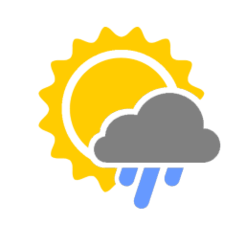

Weather widget app is suppsed to be used as standalone app or part of another web application. Despite there is a lot of the same (by functionality) apps the main idea was to touch ReactJS lib and trying to get the idea. 

### Running application
The project was created by buiteful create-react-app without eject and any other customizations. For running the app navigate (in terminal) to main folder of the project and launch the following command:

```
yarn start
```

Aplication should be opened in default browser. The application has two flipped sides, for depicting the data:


and back side for settings:


All settings are stored in and retrieved from localstorage using storejs lib.

### Open weather map API note
The application is consumed free data from [OpenWeatherMap](http://openweathermap.org) using API_KEY. I share it here just for making review a bit simplier. Anyway I absolutely realize that this not normal aproach and conflicts with [TFA](https://12factor.net) principles. 
